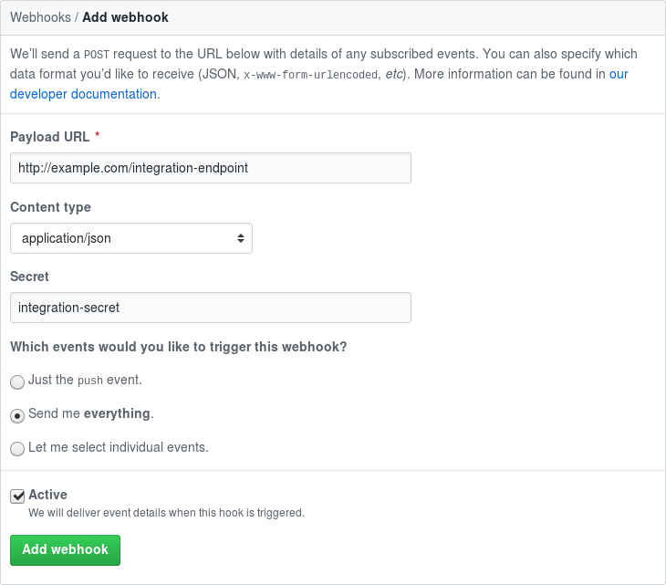

# Codebot

[](https://rubygems.org/gems/codebot)
[](https://rubygems.org/gems/codebot)
[](https://travis-ci.org/janikrabe/codebot)
[](https://inch-ci.org/github/janikrabe/codebot)

Codebot is an IRC bot that receives GitHub webhooks and forwards them to
IRC channels. It is designed to send messages in a format similar to that
of the official GitHub IRC Service. Codebot is able to stay connected after
sending messages. This eliminates the delays and visual clutter caused by
reconnecting each time a new message has to be delivered.

In addition, Codebot is able to handle many events the official service does not
support. Messages for these events are designed to be as consistent as possible
with official messages. If these additional notifications are not desired, they
can be disabled through the webhook settings.

## Features

* **Secure by default**. Codebot automatically generates strong random secrets
  for each webhook to ensure the integrity of all received data.
* **Highly configurable**. Codebot supports IRC over TLS, SASL authentication,
  password-protected IRC servers, channel keys, address binding, and more.
* **Easy to set up**. Setting up Codebot takes three minutes — no need to edit
  configuration files or memorize complicated commands.
* **Supports many events**. Codebot supports all events supported by GitHub's
  official IRC integration, and some more. Individual events can be enabled or
  disabled through the webhook settings.
* **Unlimited networks, channels and integrations**. A single instance can
  receive notifications for any number of webhooks and forward them to the
  appropriate channels on as many IRC networks as you want.
* **On-the-fly reloading**. A running Codebot instance can automatically pick
  up any new changes with no restart required. (*Changes to channel lists
  currently still require a restart to take effect.*)
* **Powered by Rack and Sinatra**. Thanks to Rack, Codebot can work with almost
  any web server, including the default `WEBrick` server for smaller instances.

## Installation

You can install Codebot from [RubyGems][rubygem] by issuing the following
command:

```
$ gem install codebot
```

## Usage

Getting Codebot up and running only takes a few minutes.

### Add a network

First, add the IRC networks you want to send notifications to. Remove `--secure`
if you need to connect without TLS.

```
$ codebot network create freenode --host chat.freenode.net --nick bot --secure
  Network was successfully created
  Network: freenode
      Server:     chat.freenode.net:6697 (secure connection)
      Nickname:   bot
      SASL authentication disabled
```

Please see `codebot network help create` for a list of possible options.
Networks can be modified using `codebot network update` and deleted
using the `codebot network destroy` command.

### Add an integration

Next, create an integration. Integrations are responsible for mapping a webhook
endpoint to a set of IRC channels. You can use the same endpoint for as many
repositories and organizations as you wish.

```
$ codebot integration create my-project -c freenode/#chan1 freenode/#chan2
  Integration was successfully created
  Integration: my-project
      Endpoint: cc5dc492-1b6a-4e13-9da9-a9cc740add1d
      Secret:   WIcSmr6bsHmv9EmaONMQ1dViu5ziKYN3gUhXoyZBh3M=
      Channels:
          - #chan1 on freenode
          - #chan2 on freenode
```

You can specify a custom endpoint using the `--endpoint` option, and a custom
secret using the `--secret` option. If the secret is set to an empty string,
the integrity of payloads will not be verified. This is highly discouraged.

Please see `codebot integration help create` for a list of possible options.
Integrations can be modified using `codebot integration update` and deleted
using the `codebot integration destroy` command.

### Configure your webhook

You can now [add a GitHub webhook][newhook] to any repositories and
organizations you'd like to receive notifications from.



Unless [otherwise configured][gateway], **Payload URL** should be in the format
`http://server:4567/endpoint`, where `server` is the IP address or host name of
the server Codebot is running on, and `endpoint` is the endpoint generated in
the previous step. Please see [Gateway Configuration][gateway] for information
on how to receive webhooks over HTTPS, and [Environment Variables][environ] if
you would like Codebot to listen on a different port.

Both possible **Content type** values are supported, but it is recommended to
use `application/json`.

**Secret** should be set to the secret created in the previous step. This value
is used for verifying the integrity of received payloads.

You may want to choose **Let me select individual events** if you do not wish
to receive notifications for all supported events.

### Start Codebot

After adding the webhook to your GitHub repository or organization, you can
manage your Codebot instance using the following commands:

```
$ codebot core interactive # Starts Codebot in the foreground (interactively)
$ codebot core start       # Starts Codebot in the background (as a daemon)
$ codebot core stop        # Stops the active Codebot instance
```

For more information, please consult the following commands:

```
$ codebot help             # General help
$ codebot help network     # Commands for managing networks
$ codebot help integration # Commands for managing integrations
$ codebot help core        # Commands for managing active instances
```

The configuration is stored in `~/.codebot.yml`, but it is not recommended to
edit this file manually.

## Environment Variables

Codebot supports the following environment variables:

* `CODEBOT_BIND` sets the address for the web server to bind to. When running
  Codebot behind a local [gateway server][gateway], this environment variable
  should be set to a loopback address like `127.0.0.1`.
* `CODEBOT_PORT` sets the port for the web server to listen on. This defaults
  to `4567`. If you need to listen on a privileged port, please set up a
  [gateway server][gateway] instead of trying to run Codebot as root.

## Gateway Configuration

Codebot can optionally run behind a proxy, gateway server or load balancer.
This allows for additional configuration that would otherwise not be possible,
such as receiving webhooks over HTTPS.

When accessed through a gateway server, Codebot normally does not need to
listen on all interfaces. It is therefore recommended to set the `CODEBOT_BIND`
environment variable to a loopback address before starting Codebot:

```
$ export CODEBOT_BIND='127.0.0.1'
```

For larger instances it is recommended to install `thin` before proceeding, as
the standard `WEBrick` server is single-threaded by default.

```
$ gem install thin
```

### lighttpd

lighttpd can be used as a gateway server using the `mod_proxy` module.

First, make sure that the `mod_proxy` module is loaded by adding the following
line to your `lighttpd.conf` file:

```
server.modules += ( "mod_proxy" )
```

Next, configure the module to redirect incoming requests to Codebot:

```
# Forward requests for an entire domain or subdomain to Codebot
# Replace codebot.example.com with the subdomain to redirect to Codebot
# If CODEBOT_BIND is set, replace 127.0.0.1 with the address Codebot listens on
# If CODEBOT_PORT is set, replace 4567 with the port Codebot listens on
$HTTP["host"] == "codebot.example.com" {
  proxy.server = ("/" => ( ( "host" => "127.0.0.1", "port" => 4567 ) ) )
}

# Alternatively, forward requests for a subdirectory to Codebot
# Replace /codebot with the subdirectory to redirect to Codebot
# If CODEBOT_BIND is set, replace 127.0.0.1 with the address Codebot listens on
# If CODEBOT_PORT is set, replace 4567 with the port Codebot listens on
proxy.header = ( "map-urlpath" => ( "/codebot" => "" ) )
proxy.server = ("/codebot" => ( ( "host" => "127.0.0.1", "port" => 4567 ) ) )
```

That's it! You'll need to reload lighttpd for your changes to take effect.

If lighttpd has been configured correctly and Codebot is running, accessing the
gateway with a browser should yield a `Method not allowed` error.

## Development

After checking out the repository, run `bundle install` to install dependencies.
You can also run `bin/console` for an interactive prompt.

During development it is recommended to set the `RACK_ENV` environment variable
to `development`. This causes the web server to listen only on the loopback
interface by default.

To install this gem onto your local machine, run `bundle exec rake install`.
To release a new version, update the version number in `metadata.rb`, and then
run `bundle exec rake release`, which will create a git tag for the version,
push git commits and tags, and push the `.gem` file to [RubyGems][rubygem].

## Contributing

Bug reports and pull requests are welcome [on GitHub][github].
Please see the [CONTRIBUTING.md][contrib] for more information.

[github]: https://github.com/janikrabe/codebot "codebot on GitHub"
[contrib]: CONTRIBUTING.md "Guidelines for Contributors"
[rubygem]: https://rubygems.org/gems/codebot "codebot on RubyGems.org"
[newhook]: https://developer.github.com/webhooks/creating/#setting-up-a-webhook
[environ]: #environment-variables "Environment Variables"
[gateway]: #gateway-configuration "Gateway Configuration"
